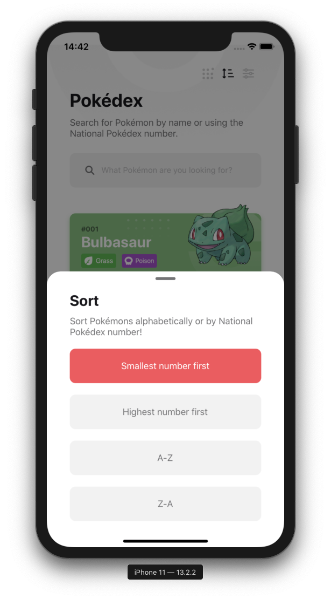
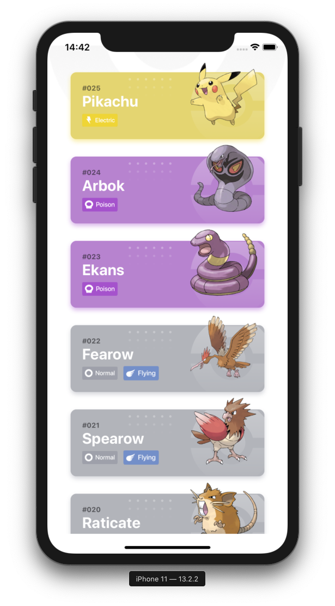
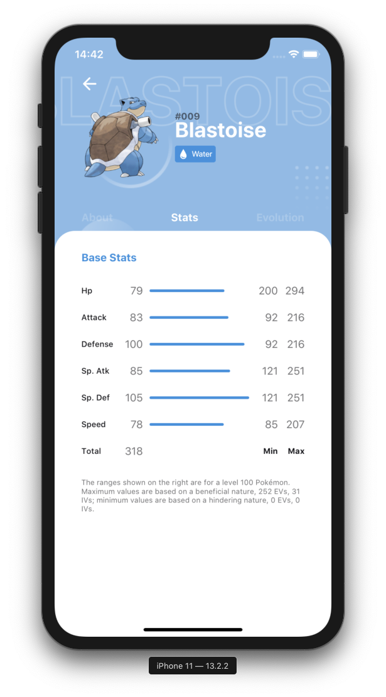
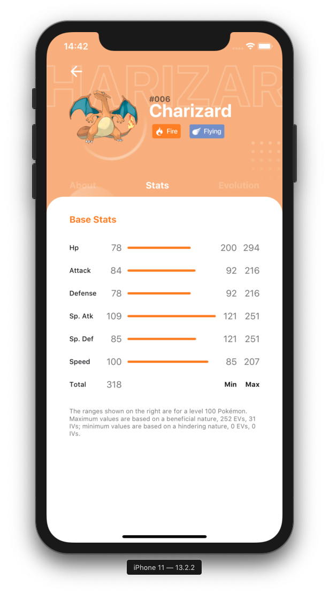

# Pokedex - React Native
> [WIP] Pokedex build in React Native, redux, redux-saga and redux-persist.

> [WIP] Pokedex desenvolvida em React Native, redux, redux-saga e redux-persist.

Projeto desenvolvido com intuito educacional e visa a criação de uma pokedex com arquitetura flux.

[](https://github.com/renankanu/gather-pets) [](https://github.com/fukhaos/Pokedex-React-Native/blob/master/LICENSE) [](https://www.linkedin.com/in/fukhaos/)

<div align="center" styles="flex-direction: row;">
  
</div>
<div align="center" styles="flex-direction: row;">
  
  
  
  
  
 </div>

## Installation

- Clone repo: `git clone https://github.com/fukhaos/Pokedex-React-Native.git`
- Install dependencies: `yarn` or `npm install` 

```sh
expo start
```


## Usage example
Scan to open
With an Android and iOS phone, you can scan this QR code with your Expo mobile app to load this project immediately.

  

## Release History

* 0.0.1
    * Work in progress

## Meta

Vinicius – [@fukhaos](https://twitter.com/fukhaos) – fukhaos@gmail.com

Distributed under the MIT license. See ``LICENSE`` for more information.

[https://github.com/fukhaos/Pokedex-React-Native](https://github.com/fukhaos/Pokedex-React-Native)

## Contributing

1. Fork it (<https://github.com/fukhaos/Pokedex-React-Native>)
2. Create your feature branch (`git checkout -b feature/fooBar`)
3. Commit your changes (`git commit -am 'Add some fooBar'`)
4. Push to the branch (`git push origin feature/fooBar`)
5. Create a new Pull Request

<!-- Markdown link & img dfn's -->
[npm-image]: https://img.shields.io/npm/v/datadog-metrics.svg?style=flat-square
[npm-url]: https://npmjs.org/package/datadog-metrics
[npm-downloads]: https://img.shields.io/npm/dm/datadog-metrics.svg?style=flat-square
[travis-image]: https://img.shields.io/travis/dbader/node-datadog-metrics/master.svg?style=flat-square
[travis-url]: https://travis-ci.org/dbader/node-datadog-metrics
[wiki]: https://github.com/yourname/yourproject/wiki
